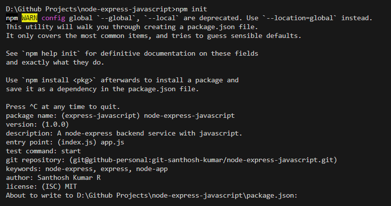

# node-express-javascript
A node-express backend service with javascript.

## Initialize the project.
Run the following command to initialize the project.
```bash
npm init
```



## git setup with command line
#Create a new repository on the command line
```bash
echo "# node-express-typescript" >> README.md
git init
git add README.md
git commit -m "first commit"
git branch -M main
git remote add origin https://github.com/git-santhosh-kumar/node-express-typescript.git
git push -u origin main
```

#Push an existing repository from the command line
```bash
git remote add origin https://github.com/git-santhosh-kumar/node-express-typescript.git
git branch -M main
git push -u origin main
```

## Libraries for development

- Express server
```bash
npm install express
```

- nodemon to run the app in restart mode.
```bash
npm install nodemon --save-dev
```

- Add the script command in package.json to run the app.
```bash
"start": "node app.js"

npm run start
```

## Third party libraries

#[mongodb](https://www.npmjs.com/package/mongodb) - MongoDB Node.js Driver
```bash
npm install mongodb --save
```

#Axios to make rest api calls.
```bash
npm install axios
```